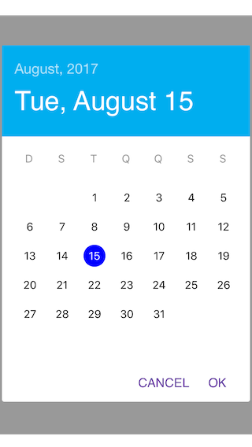

# RMCalendar

<p align="center">
<a href="#appearance">Appearance</a> &bull;
<a href="#motivation">Motivation</a> &bull;
<a href="#installation">Installation</a>
</p>
-------

## Appearance

<h3 align="center">

</h3>

## Motivation

A Custom calendar in Swift.

## Installation

This project uses [CocoaPods](https://cocoapods.org). All you need to setup it properly is:
```
pod install

```
